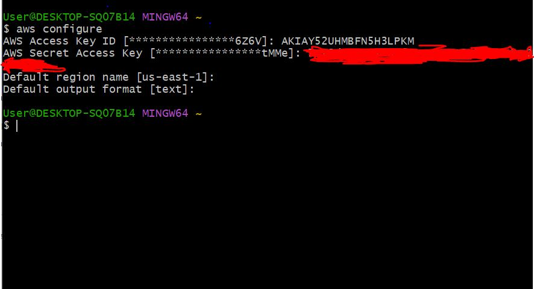
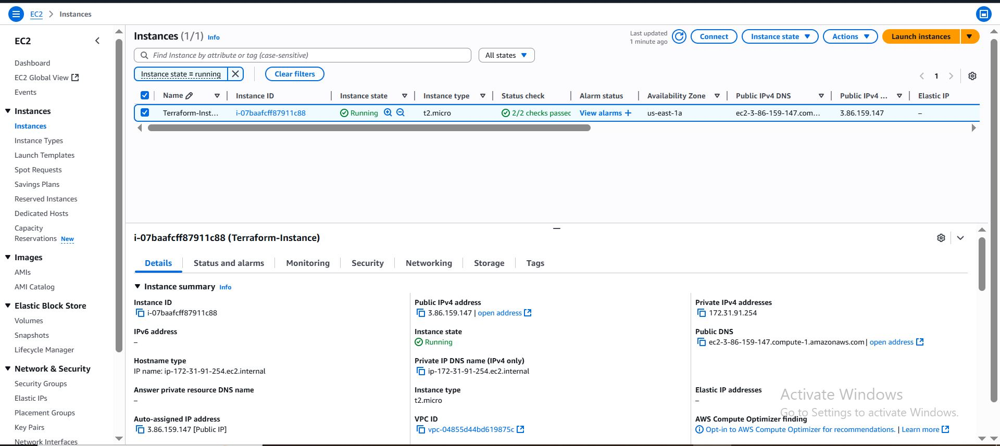
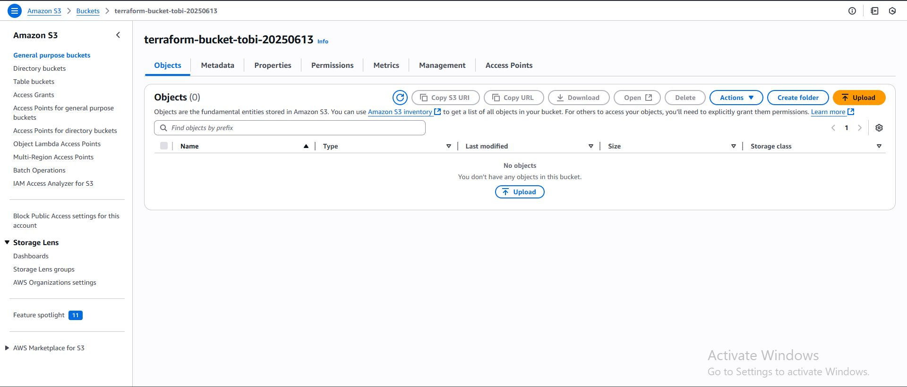
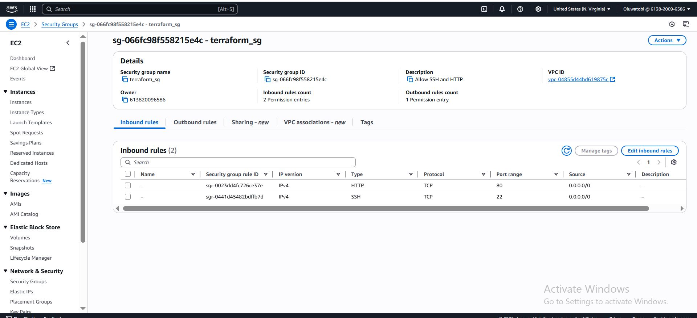

~**1. Install Terraform and configure it to work with AWS.**

  **Steps:**
  
  i. Install terraform.
  
  ii. Go to Management console to get your access key and secret key for AWS configuration.
  
  iii. Go to AWS CLI and imput:
       aws configure
       access key
       secret key
       region

  **2. Write a Terraform script to provision an EC2 instance, S3 bucket and update the infrastructure by adding a security group.**

  **Steps:**
  
  1. Open your VSCode and open a folder
     
  2. under the folder, create these files named main.tf, Variable.tf, output.tf, terraform.tfvars and provider.tf
     
  **3. In main.tf file, input:**
     
     resource "aws_instance" "WebInstance" {
  ami           = var.ami_id 
  instance_type = var.instance_type
  vpc_security_group_ids = [aws_security_group.Web_sg.id]

  tags = {
    Name = var.instance_name
  }
}

resource "aws_s3_bucket" "Test-bucket" {
  bucket = var.s3_bucket_name  # Make sure the bucket name is globally unique

  tags = {
    Name = "Terraformtestbucket"
    Environment = var.environment
      }
}

resource "aws_security_group" "Web_sg" {
  name        = "terraform_sg"
  description = "Allow SSH and HTTP"

  ingress {
    from_port   = 22
    to_port     = 22
    protocol    = "tcp"
    cidr_blocks = ["0.0.0.0/0"]
  }

  ingress {
    from_port   = 80
    to_port     = 80
    protocol    = "tcp"
    cidr_blocks = ["0.0.0.0/0"]
  }

  egress {
    from_port   = 0
    to_port     = 0
    protocol    = "-1"
    cidr_blocks = ["0.0.0.0/0"]
  }

  tags = {
    Name = "terraform_sg"
  }
}

**4. in your variable.tf file, input:**
   
   variable "ami_id" {
  description =  "The AMI ID to use for the EC2 instance"
  type        = string
}

variable "instance_type" {
  description = "EC2 instance type"
  default     = "t2.micro"
}

variable "instance_name" {
  description = "Name tag for the EC2 instance"
  default     = "Terraform-Instance"
}

variable "s3_bucket_name" {
  description = "The name for the S3 bucket"
  type        = string
  
}

variable "environment" {
  description = "Deployment environment"
  default     = "Dev"
}

**5. In output.tf file, input:**

   output "instance_id" {
  description = "EC2 instance ID"
  value       = aws_instance.WebInstance.id
}

output "bucket_name" {
  description = "S3 bucket name"
  value       = aws_s3_bucket.Test-bucket.bucket
}

output "security_group_id" {
  description = "Security group ID"
  value       = aws_security_group.Web_sg.id
}

**6. In terraform.tfvars file, input:**

   ami_id           = "ami-09e6f87a47903347c"
s3_bucket_name   = "terraform-bucket-tobi-20250613"

**7. in provider.tf file, input:**

   terraform {
  required_providers {
    aws = {
      source  = "hashicorp/aws"
      version = "~> 5.0"
    }
  }
}

provider "aws" {
  region = "us-east-1"
}

**10. Enter the following prompt:**
    
    terraform init
    terraform plan
    terraform apply

